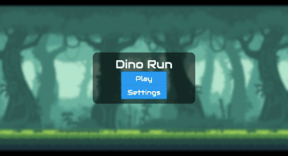
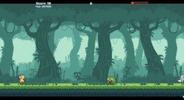
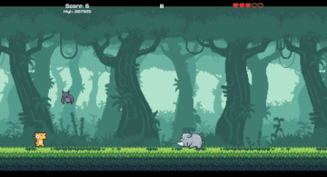

# Dino Run

A 2D infinite side scroller made using [Flame](https://flame-engine.org/) engine.

## Demo







## Downloads

- [Google Play](https://play.google.com/store/apps/details?id=com.nobs.dino_run)

- [Itch.io](https://ufrshubham.itch.io/dino-run)

## Build steps

```bash
# Clone this project
$ git clone https://github.com/ufrshubham/dino_run

# Access
$ cd dino_run

# Install dependencies
$ flutter pub get

# Run the project (Make sure that a virtual or physical device is connected first)
$ flutter run

# The will start the game on any connected device.
```

## Supported platforms

- Android
- iOS
- Windows (without audio)

## License

Assets provided in this repo are not owned by my. For more details about their origin and authors, check [assets/images/readme.md](assets/images/readme.md) and [assets/audio/readme.md](assets/audio/readme.md)

This project is under license from MIT. For more details, see the [LICENSE](LICENSE) file.

## Why the code is so different than the YouTube series?

Dino run is a simple mobile game that I originally started making, so that I can learn Flame engine. But while doing so, I couldn't find a lot of up-to date resources (apart of the official docs). So I decided to make a [YouTube series](https://www.youtube.com/playlist?list=PLiZZKL9HLmWOmQgYxWHuOHOWsUUlhCCOY) covering the development of this game.

Everything went great and in about 7 weeks I wrapped up the series (actual game completed way sooner than the series). The original game and the YouTube series was made using version 0.28 of Flame (probably latest at that time). But little did I know that Flame was under massive development preparing for the 1.0 release.

I suspected that my videos were going to get outdated pretty soon with newer versions of Flame. My plan to deal with this was to keep updating this repository with latest changes from Flame, so that new viewers of the series don't get stuck with a code that won't even build. But things got much worst after Flutter went null-safe. I tried migrating this project to null-safety and latest version of Flame multiple times. But I always ended up introducing a lot of bugs in the game.

It was not like this is a very big project and a lot of people are follow it. I was easier to leave this repository in a broken state. But personally, I've been through the frustration of trying to learn something new, spending hours and hours watching some tutorial series only to find out at the end that it is completely outdated. Remaking the whole YouTube series is a big undertaking (which I am not prepared for). But rewriting this game again wasn't that big of a deal. So finally I decided to rewrite the whole thing from scratch (almost), keeping the original code on a separate branch. Surprising it took me only few hours to get it up and running.

To check the original code, checkout the [main](https://github.com/ufrshubham/dino_run/tree/main) branch.

## Games inspired from Dino Run

This list might not contain all the project that are inspired from Dino Run, but these are the ones that I know of. If you want to add your game here or know of a game that should be featured here, feel free to open a pull request or send me the required details.

- [Fly Dash](https://play.google.com/store/apps/details?id=io.madhank93.dashy_bird&hl=en_IN) by [Madhan Kumaravelu](https://github.com/madhank93)

- [Warrior Runner](https://play.google.com/store/apps/details?id=hashim4498.games.warrior_runner&hl=en_IN) by [Mohammed Hashim](https://github.com/mohammedhashim44)

- [DinoRun](https://github.com/DetainedDeveloper/DinoRun) by [Jay](https://github.com/DetainedDeveloper)

- [run-dino-run](https://github.com/NextFaze/run-dino-run) by [Rushi Patel](https://github.com/whimzyLive)

- [Dino Running](https://play.google.com/store/apps/details?id=rteixeira.apps.dino_run) by [Renan Teixeira](https://github.com/renant)

___

Join my [Discord](https://discord.gg/xHu3aUQGsJ) if you want to discuss something about this project.
