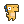

<div align="center" id="top"> 
  

  &#xa0;

  <!-- <a href="https://dino_run.netlify.app">Demo</a> -->
</div>

<h1 align="center">Dino Run</h1>

<p align="center">
  

  

  

  

  

  

  
</p>

<!-- Status -->

<h4 align="center"> 
	🚧  Dino_run 🚀 Under construction...  🚧
</h4> 

<hr>

<p align="center">
  <a href="#dart-about">About</a> &#xa0; | &#xa0; 
  <a href="#rocket-technologies">Technologies</a> &#xa0; | &#xa0;
  <a href="#white_check_mark-requirements">Requirements</a> &#xa0; | &#xa0;
  <a href="#checkered_flag-starting">Starting</a> &#xa0; | &#xa0;
  <a href="#memo-license">License</a> &#xa0; | &#xa0;
  <a href="https://github.com/ufrshubham" target="_blank">Author</a>
</p>

<br>

## :dart: About ##

Dino Run is a 2D infinite side scroller mobile game made in Flutter. This game is made using flame package, an awesome 2D game engine for flutter.

## :rocket: Technologies ##

The following tools were used in this project:

- [Flutter](https://flutter.dev/)
- [Flame](https://flame-engine.org/)

## :white_check_mark: Requirements ##

Before starting :checkered_flag:, you need to have [Git](https://git-scm.com) and [Flutter](https://flutter.dev/) installed.

## :checkered_flag: Starting ##

```bash
# Clone this project
$ git clone https://github.com/ufrshubham/dino_run

# Access
$ cd dino_run

# Install dependencies
$ flutter pub get

# Run the project (Make sure that a virtual or physical device is connected first)
$ flutter run

# The will start the game on any connected device.
```

## :memo: License ##

Assets provided in this repo are not owned by my. For more details about their origin and authors, check [assets/images/readme.md]([/assets/images/readme.md]) and [assets/audio/readme.md]([/assets/audio/readme.md])

This project is under license from MIT. For more details, see the [LICENSE](LICENSE) file.


Made with :brain: by <a href="https://github.com/ufrshubham" target="_blank">Ryuzki</a>

&#xa0;

<a href="#top">Back to top</a>
